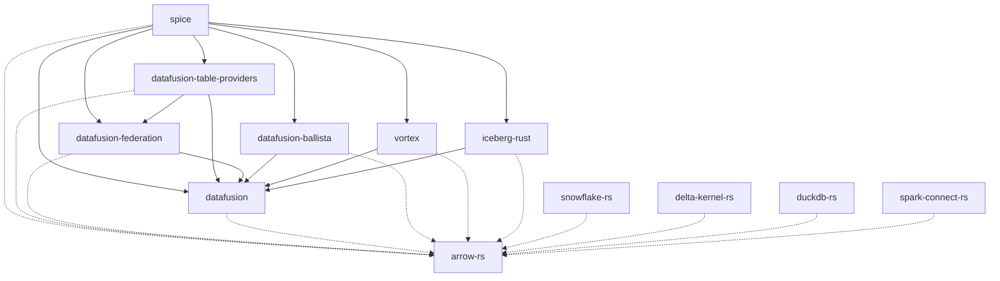

This issue tracks the process of upgrading Spice OSS to a new major version of DataFusion to maintain a version that is one major release version behind the [latest](https://github.com/apache/datafusion/tags). Because many internal crates and forked dependencies rely on DataFusion, they all need to be upgraded in lockstep.



## Fork Branch Naming Convention

For all forked dependencies, we use a two-branch strategy:

1. **Feature branch** (`spiceai-<version>`): Created directly from the upstream tag (e.g., `51.0.0`). This branch tracks the exact upstream release with no modifications.
2. **Patch branch** (`spiceai-<version>-patches`): Created from the feature branch. All Spice-specific patches are cherry-picked and applied here.

**CRITICAL: All patches must be cherry-picked individually to the `-patches` branch**, resolving any merge conflicts in the cherry-pick commit itself. This ensures:

- Each patch is a discrete commit that can be tracked and reviewed
- Conflicts are resolved once and documented in commit history
- Future upgrades can easily identify which patches need porting
- Git blame accurately reflects patch authorship

**Example workflow for DataFusion v51:**

```bash
# In the spiceai/datafusion fork
git fetch upstream --tags
git checkout -b spiceai-51 51.0.0           # Create feature branch from upstream tag
git push origin spiceai-51

git checkout -b spiceai-51-patches spiceai-51  # Create patch branch

# Cherry-pick each patch from previous version, resolving conflicts
git cherry-pick <commit-hash-from-spiceai-50>
# If conflicts, resolve them and: git cherry-pick --continue
# Repeat for each patch...

git push origin spiceai-51-patches
```

**Do NOT squash or batch patches together** - each original patch should remain as a separate cherry-picked commit.

This allows:

- Clear tracking of which patches are applied on top of which upstream version
- Easy rebasing when upstream releases patch versions (e.g., 51.0.1)
- Individual review of each patch's conflict resolution
- Simple diff comparison between patch branches across versions

## Pre-upgrade Tasks

- [ ] Read the DataFusion [changelog](https://github.com/apache/datafusion/tree/branch-49/dev/changelog) of the new version to identify breaking changes and new features.
- [ ] Read the DataFusion [blog](https://datafusion.apache.org/blog/) for the latest release.
- [ ] Read the DataFusion [upgrade guides](https://datafusion.apache.org/library-user-guide/upgrading.html).
- [ ] Identify which Arrow version the new DataFusion requires (check DataFusion's `Cargo.toml`).

## Upgrade DataFusion Fork

- [ ] Sync the forked main branch with the upstream repository.
- [ ] Create a new feature branch named `spiceai-X` from the tagged release `X.Y.Z`:

  ```bash
  git fetch upstream --tags
  git checkout -b spiceai-X X.Y.Z
  git push origin spiceai-X
  ```

- [ ] Create a patch branch named `spiceai-X-patches` from `spiceai-X`:

  ```bash
  git checkout -b spiceai-X-patches spiceai-X
  ```

- [ ] Run `cargo test` to confirm that all upstream tests pass, or make note of which tests fail for reference.
- [ ] **Cherry-pick each patch individually** from the previous patch branch (`spiceai-<X-1>-patches` or `spiceai-<X-1>`). For every Spice-specific commit after the upstream release commit:

  1. **Check if merged upstream**: Search the new release for the PR number or commit message. Example: `git log X.Y.Z --oneline --grep="<PR-number-or-keyword>"`
  2. **If NOT merged upstream**: Cherry-pick the commit individually. Resolve any conflicts and continue: `git cherry-pick <commit-hash>`
  3. **After each cherry-pick**: Run `cargo test` to confirm no regressions. If tests fail, fix them and amend the cherry-picked commit: `git commit --amend --no-edit`
  4. **Document skipped patches**: If a patch is no longer needed (merged upstream or obsolete), note it in the PR description

- [ ] Push `spiceai-X-patches` and record the commit hash for `Cargo.toml`.
- [ ] If there are no commits that need to be cherry-picked, the upstream repository tag can be used directly.

## Forked Dependency Upgrades

The following forked dependencies use DataFusion and/or Arrow and need to be upgraded in lockstep. Each fork should follow the same `spiceai-<version>` / `spiceai-<version>-patches` branching convention.

### DataFusion Ecosystem Forks

- [ ] **[datafusion-ballista](https://github.com/spiceai/datafusion-ballista)**: Distributed query execution.
  - Create `spiceai-X` branch from upstream's DataFusion-compatible release/commit.
  - Create `spiceai-X-patches` branch for Spice patches (TLS support, API key auth, UDF sync).
  - Cherry-pick patches from `spiceai-<X-1>-patches`.
  - Update DataFusion dependencies in `ballista-core` and `ballista-scheduler`.
  - Run `cargo test` to confirm compatibility.
  - **Do not merge into the `spice` branch until the main Spice OSS PR is ready to be merged.** Merging sooner can block other PRs.

- [ ] **[datafusion-federation](https://github.com/spiceai/datafusion-federation)**: Query federation support.
  - We maintain this fork separately as our changes are incompatible with upstream.
  - Create `spiceai-X` branch from the previous `spiceai-<X-1>` branch (not upstream).
  - Upgrade DataFusion dependencies and resolve breaking changes.
  - Run tests to confirm compatibility.

- [ ] **[datafusion-table-providers](https://github.com/datafusion-contrib/datafusion-table-providers)**: SQL database table providers.
  - Create `spiceai-X` branch from upstream's DataFusion-compatible release.
  - Create `spiceai-X-patches` for Spice-specific features.
  - **Do not merge into the `spiceai` branch until the main Spice OSS PR is ready to be merged.** Merging sooner can block other PRs.

- [ ] **[vortex](https://github.com/spiceai/vortex)**: Compressed array format with DataFusion integration.
  - Create `spiceai-X` branch from upstream's DataFusion-compatible release.
  - The `vortex-datafusion` crate must be compatible with the new DataFusion version.
  - Note: Vortex uses `version = "0.1.0"` in their Cargo.toml regardless of release, so we cannot use `[patch.crates-io]` and must specify git dependencies directly.

- [ ] **[iceberg-rust](https://github.com/spiceai/iceberg-rust)**: Apache Iceberg support.
  - Create `spiceai-<iceberg-version>` branch from upstream's Iceberg release tag (e.g., `v0.8.0`).
  - The `iceberg-datafusion` crate within this repository needs to be compatible with the new DataFusion version.
  - Cherry-pick any Spice-specific patches.

### Arrow Ecosystem Forks

If DataFusion upgraded Arrow, the following crates should be upgraded:

- [ ] **[arrow-rs](https://github.com/spiceai/arrow-rs)**: Core Arrow implementation.
  - Create `spiceai-<arrow-major>` branch from upstream tag (e.g., `spiceai-57` from `57.1.0`).
  - Cherry-pick any Spice-specific patches from previous branch.
  - All arrow-* crates and parquet must use the same revision.

- [ ] **[duckdb-rs](https://github.com/spiceai/duckdb-rs)**: DuckDB Rust bindings with Arrow support.
  - Create `spiceai-<arrow-major>` branch (e.g., `spiceai-57`).
  - Update arrow dependencies to match new version.
  - Cherry-pick Spice patches (connection pool improvements, etc.).

- [ ] **[delta-kernel-rs](https://github.com/spiceai/delta-kernel-rs)**: Delta Lake kernel.
  - Create `spiceai-<delta-version>` branch from upstream tag.
  - Update arrow dependencies to match new version.

- [ ] **[snowflake-rs](https://github.com/spiceai/snowflake-rs)**: Snowflake connector.
  - Create `spiceai-<arrow-major>` branch.
  - Update arrow dependencies to match new version.

- [ ] **[spark-connect-rs](https://github.com/spiceai/spark-connect-rs)**: Spark Connect client.
  - Create or update branch with compatible arrow version.
  - Update arrow dependencies.

- [ ] **[spice-rs](https://github.com/spiceai/spice-rs)**: Spice Rust SDK.
  - Update arrow dependencies to match new version.

### Other Forks (Less Frequently Updated)

These forks may not require changes for every DataFusion upgrade but should be verified:

- [ ] **[candle](https://github.com/spiceai/candle)**: ML framework (cudarc compatibility).
- [ ] **[rusqlite](https://github.com/spiceai/rusqlite)**: SQLite bindings.
- [ ] **[dotenvy](https://github.com/spiceai/dotenvy)**: Environment variable loading.
- [ ] **arrow-odbc**: ODBC Arrow bridge (upstream, may need version bump).
- [ ] **object_store**: Object store abstraction (apache/arrow-rs-object-store).

## Core Dependency Upgrade

- [ ] Create a new branch in Spice for the upgrade process. A personal branch may be best until tests at the end are passing to avoid issues with protected branch names.
- [ ] Update the `datafusion` dependency in the root `Cargo.toml` to the new patched commit.
  - Update **all** datafusion-* crate patches to the same revision.
- [ ] If Arrow needs updating, update the `arrow-rs` dependency in the root `Cargo.toml` to the new patched commit.
  - Update **all** arrow-* crate patches and `parquet` to the same revision.
- [ ] Update the `datafusion-ballista` dependency (ballista-core, ballista-executor, ballista-scheduler) to the new patched commit.
- [ ] Update the `datafusion-federation` dependency to the new patched commit.
- [ ] Update the `datafusion-table-providers` dependency to the new patched commit.
- [ ] Update the `vortex-*` dependencies to the new revision (direct git deps, not patches).
- [ ] Update `iceberg-*` dependencies to the new patched commit.
- [ ] Update `duckdb` dependency to the new patched commit.
- [ ] Update `delta_kernel` dependency to the new patched commit.
- [ ] Run `make build` to ensure the entire project compiles without errors.
  - [ ] Address any compilation errors. Common issues include:
    - API changes (check upgrade guides)
    - New required trait methods
    - Changed method signatures
    - Removed deprecated methods
- [ ] Run all tests using `make build-cli nextest` to verify that all functionality is working as expected and snapshots have not changed.
- [ ] Create a pull request with the changes.
- [ ] Ensure all CI checks pass.
- [ ] Build the branch version and test with test operator, updating snapshots if needed.
- [ ] Merge PR. 🎉

## Forked Dependency Test Coverage

This section documents which tests in the Spice test suite verify the functionality of each forked dependency. **If a fork's patches are missing or incompatible after an upgrade, these tests should fail.**

When upgrading, ensure all these tests pass. If adding a new patch to a fork, add corresponding test coverage.

### DataFusion (`spiceai/datafusion`)

| Patch/Feature                                   | Test Location                         | What It Verifies                                                                                                 |
| ----------------------------------------------- | ------------------------------------- | ---------------------------------------------------------------------------------------------------------------- |
| UDTF args in TableScan name (cache correctness) | `crates/runtime/tests/results_cache/` | Different UDTF calls (e.g., `read_parquet('/a')` vs `read_parquet('/b')`) don't incorrectly share cached results |
| Core query execution                            | All integration tests                 | DataFusion query planning and execution                                                                          |
| UDF/UDAF support                                | `crates/runtime/tests/` (various)     | User-defined functions work correctly                                                                            |

### Ballista (`spiceai/datafusion-ballista`)

| Patch/Feature              | Test Location               | What It Verifies                            |
| -------------------------- | --------------------------- | ------------------------------------------- |
| mTLS cluster communication | `crates/runtime/tests/tls/` | Secure scheduler-executor connections       |
| UDF synchronization        | Cluster mode tests          | UDFs available across distributed executors |
| Catalog synchronization    | Cluster mode tests          | Tables visible across cluster               |

### DataFusion Federation (`spiceai/datafusion-federation`)

| Patch/Feature            | Test Location                                          | What It Verifies                      |
| ------------------------ | ------------------------------------------------------ | ------------------------------------- |
| Federated query pushdown | `crates/runtime/tests/acceleration/query_push_down.rs` | Queries pushed to source databases    |
| Multi-source federation  | Various connector tests                                | Joining across different data sources |

### DataFusion Table Providers (`datafusion-contrib/datafusion-table-providers`)

| Patch/Feature        | Test Location                    | What It Verifies                |
| -------------------- | -------------------------------- | ------------------------------- |
| PostgreSQL connector | `crates/runtime/tests/postgres/` | PostgreSQL table provider works |
| MySQL connector      | `crates/runtime/tests/mysql/`    | MySQL table provider works      |
| SQLite connector     | `crates/runtime/tests/sqlite/`   | SQLite table provider works     |
| DuckDB connector     | `crates/runtime/tests/duckdb/`   | DuckDB table provider works     |

### Vortex (`spiceai/vortex`)

| Patch/Feature                 | Test Location                   | What It Verifies                                |
| ----------------------------- | ------------------------------- | ----------------------------------------------- |
| Vortex-DataFusion integration | `crates/runtime/tests/cayenne/` | Cayenne accelerator with Vortex columnar format |
| Vortex array operations       | `crates/cayenne/` benchmarks    | Compressed array read/write                     |

### Iceberg-Rust (`spiceai/iceberg-rust`)

| Patch/Feature                  | Test Location                       | What It Verifies                   |
| ------------------------------ | ----------------------------------- | ---------------------------------- |
| Iceberg-DataFusion integration | `crates/runtime/tests/iceberg/`     | Iceberg table scans via DataFusion |
| Glue catalog support           | `crates/runtime/tests/glue/`        | AWS Glue Iceberg catalog           |
| REST catalog support           | `crates/runtime/tests/iceberg_api/` | Iceberg REST catalog               |

### Arrow-RS (`spiceai/arrow-rs`)

| Patch/Feature         | Test Location                  | What It Verifies            |
| --------------------- | ------------------------------ | --------------------------- |
| Arrow IPC / Flight    | `crates/runtime/tests/flight/` | Arrow Flight protocol       |
| Parquet read/write    | All accelerator tests          | Parquet file operations     |
| Core array operations | All tests                      | Fundamental data operations |

### DuckDB-RS (`spiceai/duckdb-rs`)

| Patch/Feature       | Test Location                       | What It Verifies              |
| ------------------- | ----------------------------------- | ----------------------------- |
| DuckDB accelerator  | `crates/runtime/tests/duckdb/`      | DuckDB as acceleration engine |
| Arrow compatibility | `crates/runtime/tests/rehydration/` | Arrow<->DuckDB data transfer  |
| Connection pooling  | DuckDB accelerator tests            | Concurrent DuckDB access      |

### Delta Kernel (`spiceai/delta-kernel-rs`)

| Patch/Feature    | Test Location                             | What It Verifies               |
| ---------------- | ----------------------------------------- | ------------------------------ |
| Delta Lake reads | `crates/runtime/tests/delta_lake/`        | Reading Delta tables           |
| Databricks Delta | `crates/runtime/tests/databricks_delta*/` | Databricks-hosted Delta tables |

### Snowflake-RS (`spiceai/snowflake-rs`)

| Patch/Feature       | Test Location                     | What It Verifies         |
| ------------------- | --------------------------------- | ------------------------ |
| Snowflake connector | `crates/runtime/tests/snowflake/` | Snowflake table provider |

### Spark Connect (`spiceai/spark-connect-rs`)

| Patch/Feature    | Test Location                             | What It Verifies                       |
| ---------------- | ----------------------------------------- | -------------------------------------- |
| Spark connector  | `crates/runtime/tests/spark/`             | Spark table provider via Spark Connect |
| Databricks Spark | `crates/runtime/tests/databricks_spark*/` | Databricks-hosted Spark                |

### Dotenvy (`spiceai/dotenvy`)

| Patch/Feature                 | Test Location                                                                     | What It Verifies                                 |
| ----------------------------- | --------------------------------------------------------------------------------- | ------------------------------------------------ |
| Disable variable substitution | `crates/runtime-secrets/src/stores/env.rs::test_dotenvy_no_variable_substitution` | `.env` values with `$` chars preserved literally |

### Rusqlite (`spiceai/rusqlite`)

| Patch/Feature      | Test Location                   | What It Verifies              |
| ------------------ | ------------------------------- | ----------------------------- |
| SQLite accelerator | `crates/runtime/tests/sqlite/`  | SQLite as acceleration engine |
| Cayenne metastore  | `crates/runtime/tests/cayenne/` | SQLite metadata storage       |

### Candle (`spiceai/candle`)

| Patch/Feature        | Test Location                           | What It Verifies             |
| -------------------- | --------------------------------------- | ---------------------------- |
| ML model inference   | `crates/runtime/tests/models/`          | Local ML model execution     |
| Embedding generation | `crates/runtime/tests/models/search.rs` | Vector embeddings for search |

## Common API Changes Reference

This section documents breaking API changes encountered during upgrades. Update this list as new patterns emerge.

### DataFusion v51 Breaking Changes

1. **`CreateExternalTable` struct changes**
   - Added new `or_replace: bool` field (required)
   - Fix: Add `or_replace: false` to all struct initializations

2. **`UnionExec::try_new` return type change**
   - Now returns `Result<Arc<dyn ExecutionPlan>>` instead of `Result<Self>`
   - Fix: Remove `Arc::new()` wrapper when calling `try_new()`

   ```rust
   // Before (DF50)
   let union: Arc<dyn ExecutionPlan> = Arc::new(UnionExec::try_new(children)?);

   // After (DF51)
   let union: Arc<dyn ExecutionPlan> = UnionExec::try_new(children)?;
   ```

3. **`ScalarAndMetadata` no longer implements `PartialEq`**
   - Can't compare `ParamValues` directly in tests
   - Fix: Compare `.value()` field instead

   ```rust
   // Before
   assert_eq!(scalar_and_metadata_a, scalar_and_metadata_b);

   // After
   assert_eq!(scalar_and_metadata_a.value(), scalar_and_metadata_b.value());
   ```

4. **`ParamValues::from` type ambiguity**
   - `Vec<T>` implementations require explicit types
   - Fix: Use explicit `ScalarValue` construction

   ```rust
   // Before
   ParamValues::from(vec![1.into()])

   // After
   ParamValues::from(vec![ScalarValue::Int32(Some(1))])
   ```

5. **`FederationProvider::name` return type change**
   - Now returns `&'static str` instead of `&str`
   - Fix: Update trait implementations to use static strings

6. **`FileScanConfigBuilder` method rename**
   - `with_projection` renamed to `with_projection_indices`

7. **`IpcDataGenerator::encoded_batch` renamed**
   - Renamed to `encode` with additional `CompressionContext` parameter

   ```rust
   // Before
   encoder.encoded_batch(&batch, &mut tracker, &options)

   // After
   let mut compression_context = CompressionContext::default();
   encoder.encode(&batch, &mut tracker, &options, &mut compression_context)
   ```

8. **`SqlTable::new` signature change**
   - Removed the `Engine` parameter

   ```rust
   // Before
   SqlTable::new("postgres", &pool, "table_name", None)

   // After
   SqlTable::new("postgres", &pool, "table_name")
   ```

9. **`InsertBuilder::new` signature change**
   - Second parameter now takes `&[RecordBatch]` instead of `Vec<RecordBatch>`

   ```rust
   // Before
   InsertBuilder::new(&table_ref, batches)

   // After
   InsertBuilder::new(&table_ref, &batches)
   ```

10. **`PushMetricExporter::export` signature change**
    - Now takes `&ResourceMetrics` instead of `&mut ResourceMetrics`

### Clippy Expectation Changes

Some clippy lints may become fulfilled/unfulfilled after upgrades:

- `clippy::result_large_err` - Error types may change size
- `#[expect(dead_code)]` - Previously dead code may now be used (or vice versa)

Fix: Run `make lint-rust` and remove/add expectations as needed.

## Post-Upgrade Tasks

- [ ] Update this template if the upgrade process revealed new steps or forks.
- [ ] Document any breaking changes in release notes.
- [ ] Verify all fork branches are pushed and tagged appropriately.
- [ ] Update the "Common API Changes Reference" section with any new patterns encountered.
