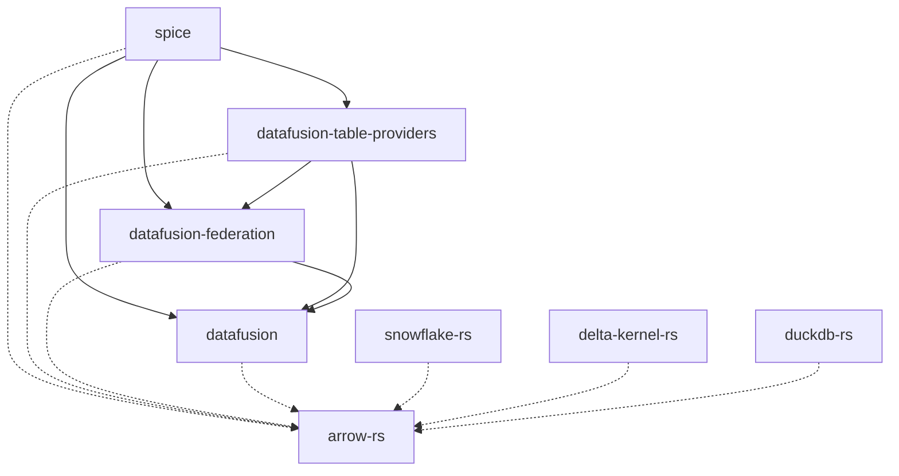

This issue tracks the process of upgrading Spice OSS to a new major version of DataFusion to maintain a version that is one major release version behind the [latest](https://github.com/apache/datafusion/tags). Because many internal crates and forked dependencies rely on DataFusion, they all need to be upgraded in lockstep.

## Pre-upgrade Tasks

- [ ]  Read the DataFusion [changelog](https://github.com/apache/datafusion/tree/branch-49/dev/changelog) of the new version to identify breaking changes and new features.
- [ ]  Read the DataFusion [blog](https://datafusion.apache.org/blog/) for the latest release.
- [ ]  Read the DataFusion [upgrade guides](https://datafusion.apache.org/library-user-guide/upgrading.html).

## Upgrade DataFusion Fork
- [ ]  Sync the forked main branch with the upstream repository.
- [ ]  Create a new branch named `spice-X` from the tagged release, `X.Y.Z`, that is being upgraded to.
- [ ]  Run `cargo test` to confirm that all upstream tests pass, or make note of which tests fail for reference.
- [ ]  View the previous branch (i.e. `spice-<X-1>`) commit history. For every commit after the upstream (previous) release commit:
  - Confirm the commit has been merged upstream and is in the new release **OR**
  - Cherry-pick the commit onto the new `spice-X` branch. This may involve resolving merge conflicts. Rerun `cargo test` confirming there are no new failed tests. If there are failed tests, fix them and amend the cherry-picked commit so that the fixes live with the patch.
- [ ]  If there are no commits that need to be cherry-picked, the upstream repository can be used directly.

## Forked Dependency Upgrades

The following forked dependencies use DataFusion and need to be upgraded in lockstep. This typically involves pulling the latest changes from the upstream repository, resolving conflicts, and updating the commit hash in `Cargo.toml` (See [Core Dependency Upgrade](#core-dependency-upgrade)).
- [ ]  **[datafusion-federation](https://github.com/spiceai/datafusion-federation)**: Update the fork to be compatible with the new DataFusion version.
- [ ]  **[datafusion-table-providers](https://github.com/datafusion-contrib/datafusion-table-providers)**: Update the fork to be compatible with the new DataFusion version.
  - Do not merge the into the `spiceai` branch until the main Spice OSS PR is ready to be merged. Merging sooner can block other PRs.
- [ ]  **[iceberg-rust](https://github.com/spiceai/iceberg-rust.git)**: The `iceberg-datafusion` crate within this forked repository needs to be updated.

## Arrow Updates (if necessary)
Spice should use the same version of Arrow that DataFusion uses. If DataFusion upgraded Arrow, then the following crates should be upgraded.

- [ ]  **arrow-rs**: 
- [ ]  **snowflake-rs**: 
- [ ]  **delta-kernel-rs**: 
- [ ]  **duckdb-rs**: 

## Core Dependency Upgrade

- [ ]  Create a new branch in Spice for the upgrade process. A personal branch may be best until tests at the end are passing to avoid issues with protected branch names.
- [ ]  Update the `datafusion` dependency in the root `Cargo.toml` to the new patched commit.
- [ ]  If Arrow needs updating, update the `arrow-rs` dependency in the root `Cargo.toml` to the new patched commit.
- [ ]  Update the `datafusion-federation` dependency in the root `Cargo.toml` to the new patched commit.
- [ ]  Update the `datafusion-table-providers` dependency in the root `Cargo.toml` to the new patched commit.
- [ ]  Update the `datafusion-federation` dependency in the root `Cargo.toml` to the new patched commit.
- [ ]  Run `make build` to ensure the entire project compiles without errors.
  - [ ]  Address any compilation errors or test failures. This may involve fixing code that is incompatible with the new DataFusion version
- [ ]  Run all tests using `make build-cli nextest` to verify that all functionality is working as expected and snapshots have not changed.
- [ ]  Create a pull request with the changes.
- [ ]  Ensure all CI checks pass.
- [ ]  Build the branch version and test with test operator, updating snapshots if needed.
- [ ]  Merge PR. 🎉
